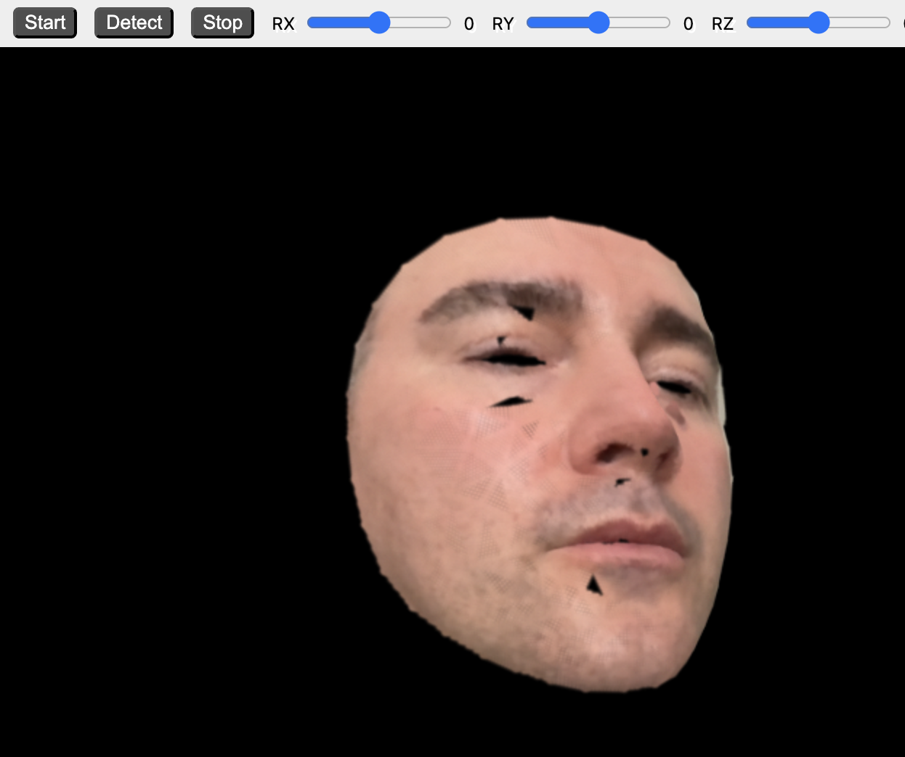

# Splat Face

This repository contains experimental web based demo of a Gaussian Splatting rendering technique applied to human face mesh all working in real time.

<p align="center">
  
</p>

Notice: this is only a proof of concept not to be used for production

- gaussian splatting implemented with help of excellent gsplat [library by huggingface](https://github.com/huggingface/gsplat.js/)
- face mesh detection via [ML5.js](https://docs.ml5js.org/#/reference/facemesh) and [TensorFlow.js](https://www.tensorflow.org/js)
- glued together with the help of my micro framework [bendis](https://github.com/sjovanovic/bendis)

## Installation

```
npm install
```

## Running

```
npm run dev
```